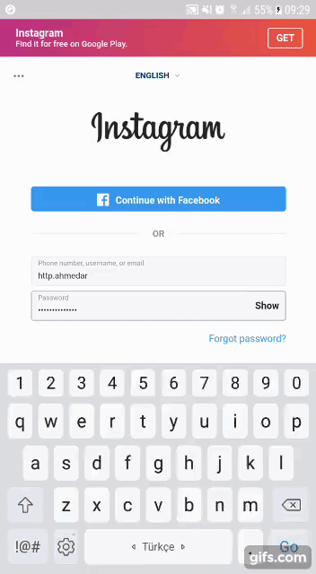
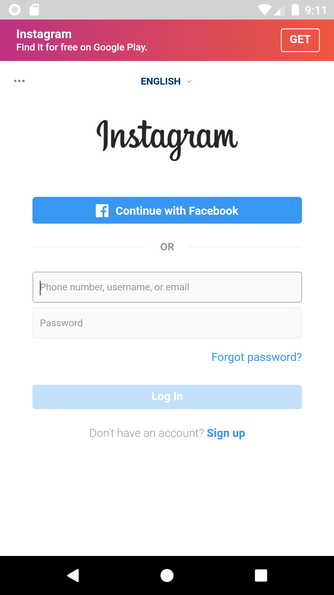
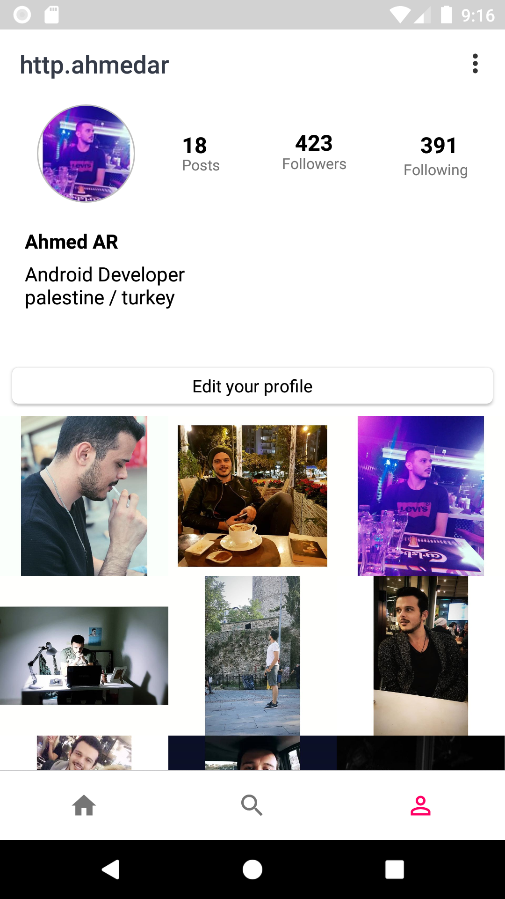

# InstagramClone
Instagram clone app

this app uses instageam Api https://www.instagram.com/developer/ to get user information and user images.
also this app works with:
1. Retrotift 2 to fetch JSON data from instagram api https://square.github.io/retrofit/
2. Picasso to cach user images https://square.github.io/picasso/.

